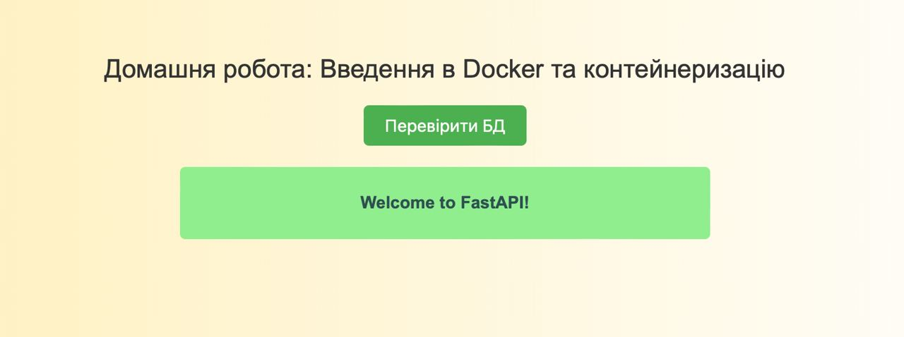

# GoITNeo CS HW-02

## Task1

Write a script that automatically checks if specific websites are available.
The script should use the `curl` command to send HTTP GET requests to each website in the list and check the response for a HTTP status code of 200, which indicates a successful availability.

### Instructions

* List of websites. In your script, there should be an array of URLs of websites that need to be checked. For example, `https://google.com`, `https://facebook.com`, `https://twitter.com`.
* Checking availability. The script should check each website from the list using `curl`, ensuring that the site is available by checking for a HTTP status code of 200.
* Writing results to a file. For each website, the result of the check (available or not available) should be written to a file logs. The name of the file logs should be defined in the script.
* Formatting output. The results should be clearly formatted, for example: "[https://google.com](https://google.com/) is UP" or "[https://twitter.com](https://twitter.com/) is DOWN".
* Output information. After running the script, a message should be displayed indicating that the results have been written to a file with its name.

### Solution

The bash file is `website_status.sh` and a log file is `website_status.log`.

## Task2

Clone `FastAPI` application, configure and run it in Docker container. Verify correctness of application's work and connection to the database.

### Step-by-step instruction
 * Clone repository using command `git clone https://github.com/GoIT-Python-Web/Computer-Systems-hw02`. Navigate to cloned directory.
 * Create `Dockerfile` with instructions for building Docker image of the application.
 * Create `docker-compose.yaml` with configuration for application and PostgreSQL.
 * Use Docker Compose to build environment, run command `docker-compose up` to start environment.

### Solution

The `Dockerfile` and the `docker-compose.yaml` are ready.

Check is passed

